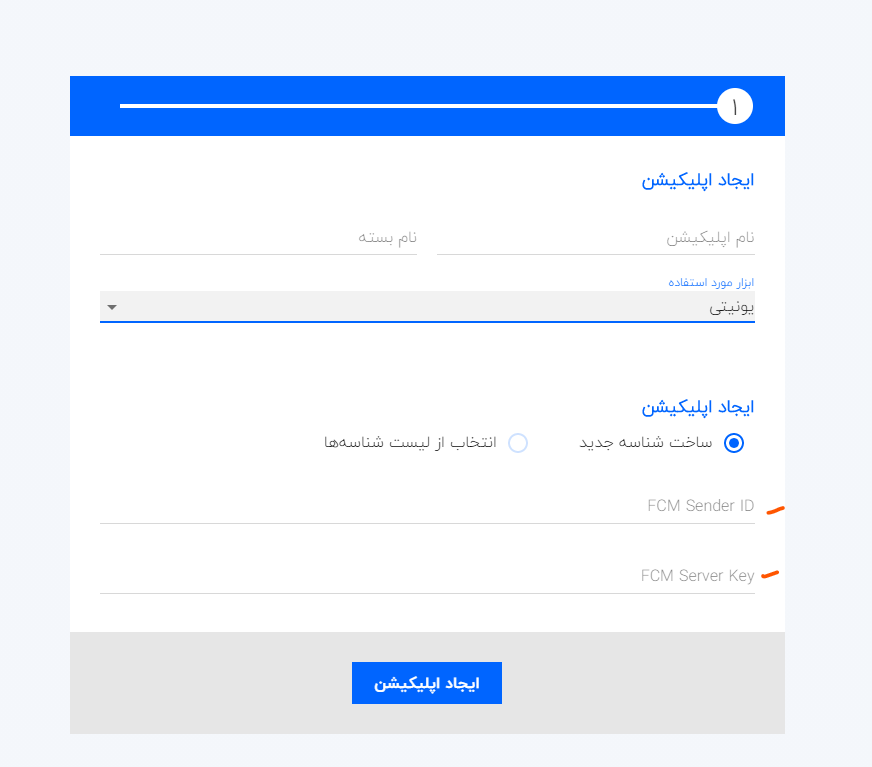

# Set up pushe for your app

## 1. Create a firebase account

> **Why?** Pushe uses FCM cloud messaging to be able to send message to your clients. Other than FCM there is no optimum way to do this on Android devices. Because Google play service uses FCM socket and keeps it alive.

1. Create an account on [Firebase console](https://console.firebase.google.com) and add a project
2. Copy the needed credentials
   - `server_key`: Needed for Pushe to be able to send messages using your project.
   - `sender_id`: For your client users to be able to register to firebase.

## 2. Create a Pushe account

1. Head over to [Pushe console](https://console.pushe.co) and create an account.
2. Create an application and pass the mentioned IDs to it.

## Copy the Token

## Read the docs of your own Platform

Checkout [Pushe documents](https://docs.pushe.co) and choose your own framework.